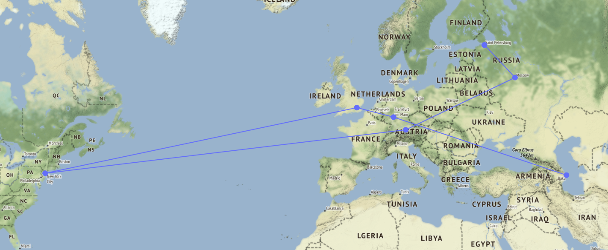

# traceroute-analysis

**traceroute** tracks the pathway of an IP packet including all hops from the source to its destinations.
During this project we will analyze the output and identify long detours to get practical information of Internet censorship and the interests of Internet Service Providers (ISPs).

The produces scripts use this [traceroute](https://github.com/ayeowch/traceroute) tool to fetch the information in JSON format.

---

## **Map Visualization**

This script displays the path produced through traceroute given an IP or a domain name and the country or origin.

**Usage**

```
python3 map_visualization.py [ip || domain name] origin_country
```

**Options** \
Choose 'LO' for **localhost** to run traceroute locally, 'AU' for **Australia**, 'CH' for **Switzerland**, 'JP' for **Japan**, 'RU' for **Russia**, 'UK' for **United Kingdom** or 'US' for **United States**.



---

## **Collect data**

For the collection of data, traceroute was used to identify the path of the packages for the IPs mentioned in `ips.txt`. All the collected data are written to the corresponding file.

**Data structure**

```json
{
    "dest_ip": "91.236.122.136",
    "dest_country": "Germany",
    "total_hops": 7,
    "success": "no",
    "ips": [
      "80.113.24.205",
      ...,
    ],
    "countries": [
      "Netherlands",
      ...,
    ],
    "rtt": [
        "7.366 ms",
        ...
    ],
    "as": [
      "AS33915 Vodafone Libertel B.V.",
      ...
    ],
    "isp": [
      "Vodafone Libertel B.V.",
      ...
    ],
    "detour": "no"
}
```

## **Compare data**

This script is used to compare the generated results. Given the folder with the corresponding JSON files we can plot the success rate per country and compare the ISPs and detours.

**Usage**

```
python3 collect_data.py folder_path operation
```

**Available operations**:

- plot_success
- compare_isps
- compare_detours

---
